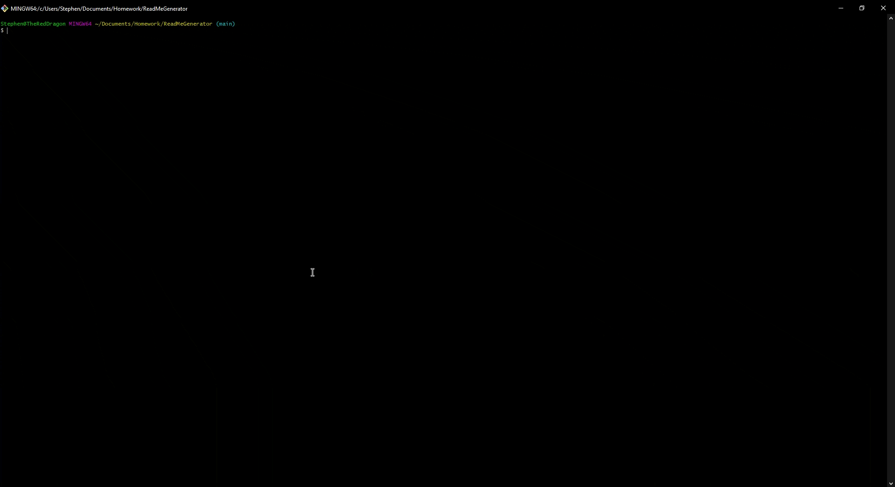

<div id="top"></div>

<!-- TABLE OF CONTENTS -->
## Table of Contents

* [Description](#description)
* [Installation](#installation)
* [Usage](#usage)
* [License](#license)
* [Demo](#demo)

<p align="right">(<a href="#top">back to top</a>)</p>

<!-- DESCRIPTION -->
## Description

* Built with NodeJS, this simple app allows you to generate a README.md file based on your project's details and specifications. We worked on this to save time when spinning up new projects, and to serve as a base for future improvements and features to make our lives easier.

* This README file was generated with the app! See the /output folder for another example README.

<p align="right">(<a href="#top">back to top</a>)</p>

<!-- INSTALLATION -->
## Installation

1. Clone the repo with your preferred method
```sh
git clone https://github.com/your_username_/Project-Name.git
```
2. Install NPM packages
```sh
npm install
```

<p align="right">(<a href="#top">back to top</a>)</p>

<!-- USAGE -->
## Usage

1. Run index.js via Node
```sh
node ./index.js
```

<p align="right">(<a href="#top">back to top</a>)</p>

<!-- LICENSE -->
## License

* This application is covered under the MIT license.

<p align="right">(<a href="#top">back to top</a>)</p>

<!-- PROJECT EXAMPLE -->
## Demo

* Walkthrough video:   


<p align="right">(<a href="#top">back to top</a>)</p>
